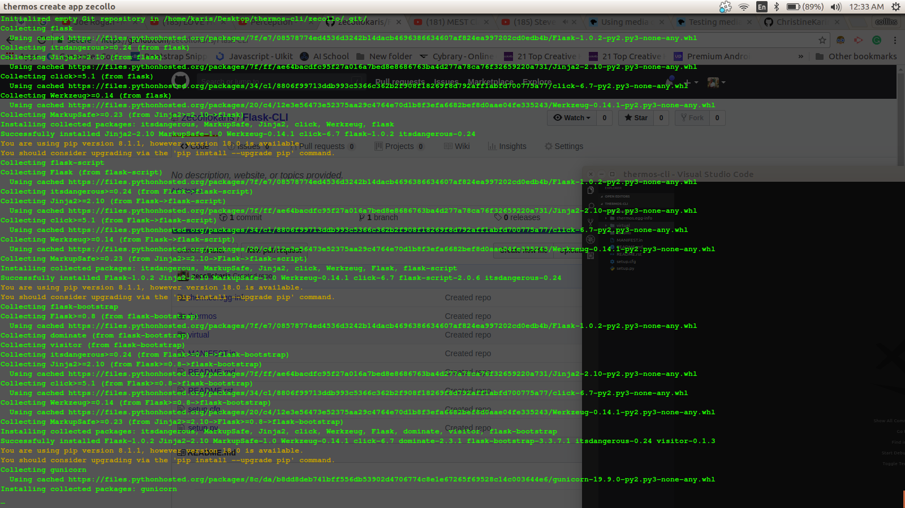
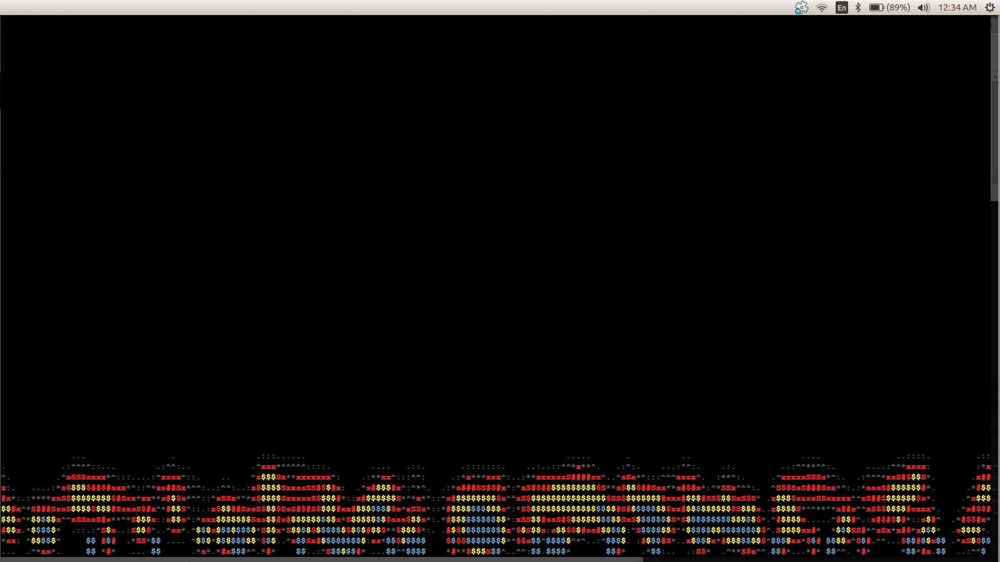

# DESCRIPTION 

This CLI is called **THERMOS**.

Lets start by describing What a CLI is to allow users to understand the intrigue behind this application.

A **command-line interface** or command language interpreter (CLI), also known as command-line user interface, console user interface and character user interface (CUI), is a means of interacting with a computer program where the user (or client) issues commands to the program in the form of successive lines of text (command lines). A program which handles the interface is called a command language interpreter or **shell**.

So this basically means that you will only be dealing with the terminal for a CLI as u will notice

### What is Flask

Flask is a microframework for Python based on Werkzeug, Jinja 2 and good intentions.

Flask is a **micro web framework** written in **Python**. It is classified as a microframework because it does not require particular tools or **libraries** and is mostly used to build small application with simpler requirements.

---

# WHAT THIS CLI DOES FOR YOU 

Due to the extensive installations and requirements to start this cli makes it easy to:

1. Create the app.

2. Create blueprints.

3. Create template.

**By starting the app it simply:**

1. Creates a folder for you.

2. Initializes Empty Git Repository

3. Installs **flask**

4. Installs **werkzeug**

5. Installs **click**

6. Installs **Jinja**

7. Installs **flask script**

8. Installs **flask-bootstrap**

9. Installs **gunicorn**

10. Installs **flask-wtf**

11. Installs **flask-sqalchemy**

**CREATED FILES**

The script also **helps in creating files needed in flask** and this making it easy for you to code as you no longer hav to create them on your own.

It simply creates files and adds the preset standard code thats will not change in any given file structure.

**You are now ready to code.** 


---


#  DISPLAY






---

## AUTHORS

**Credits**

* Collins Kariuki.

* Mwangi Njuguna.

* Faith Thuita.

* Christine Karimi.


# Prerequisites

* You need to have nano text editor installed. you can find out whether you have it installed by typing nano --version in your terminal. For most linux distributions, it is installed by default. 


**Installing Nano Text Editor.**

-However, if you don't have it installed, you can quicky do that by typing:


```
 sudo apt-get install nano
```

* You need to have (python3.6) installed in your machine.

-To check if you already have python3.6 before installing type:


```
python3.6 -V
```

**Installing Python3.6**

To install python3.6 you can quicky do that by typing:


```
sudo apt-get install python3.6
```

# Setup/Installation Reqiurements.

**To work With this cli {follow the below instructions for set up.}**

1. You will need Internet connection.

2. You will also need a Webpage URL to load in URL's:

3. To get to this CLI fist you need to get to the Flask-CLI repository. 

Link:-> ```https://github.com/zecollokaris/Flask-CLI```

4. From there you can access the CLI.

5. **Clone** the project.

6. Once you done with cloning and project is on your device.

7. get into project folder (cd into project). 

8. Install virtual environment

    ```
    python3.6 -m venv virtual
    ```

9. Activate Virtual environment.

    ```
    source virtual/bin/activate
    ```

10. **Install the CLI**

    ```
    pip install -e .
    ```
    
11. Once you are done with installing you are good to go.

12. You can get help on using the cli thermos by typing:

    ```
    thermos --help
    ```

13. You can get to knw the version by typing:

    ```
    thermos --version
    ```

# HOW TO USE

Both the CLI and generated project have dependencies that require python3.6.

Once your done with installing the CLI you can use the following commands to start working with Flask. 

1. **Generate A Flask Project.**

    ```
    thermos create app PROJECT NAME
    ```

2. **Generate Template.**

    ```
    thermos create template TEMPLATENAME
    ```

3. **Generate Blueprint**

    ```
    thermos create blueprint BLUEPRINTNAME
    ```

4. **Once you are done you can move your file to another location of your choice. This is to enable you to push your work to github in your own repository as the ClI has already been initialized using git.**

# PREVIEW

As an example I created a simple instance for you to see.

Checkout ( **zecollo** ) within the files. It is a simple example of the flask file structure created using the CLI.

**zecollo** -This is an app example created using the CLI.

**zecollo-template.html** -This is a template example created using the CLI you will find it inside the templates folder.

**zecolloblueprint** -This is a blueprint example created using the CLI similar to the others.

**Once your done you can delete the app zecollo. - It only serves as an example**

Note.

**Do not delete any other files apart from zecollo. They are all needed to the CLI to work.**

# FEEDBACK

To improve this README.md so as to allow others to use easyly please give feedback so as to improve and help others use the it much easier. Feed back will be really appreciated especially on errors you encounter.

Still under constant improvements

# Support and Contact

-Mobile number: (+254) 798731203

-Email Address: collo.kariss@gmail.com

-github-username: zecollokaris

---

## License

The app is licensed by MIT.

MIT (c) 2018 - 2020 

Feel FREE to contribute to make the CLI better for easier use by others.

---